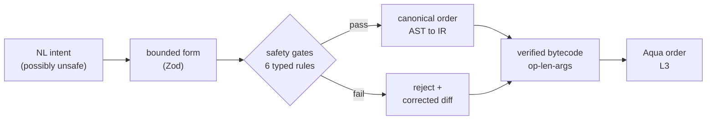
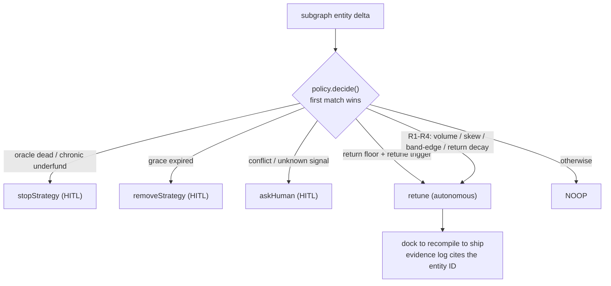

# wave

> **A social market for natural-language on-chain strategies, built on 1inch SwapVM.**

[](https://soliditylang.org/) [](https://book.getfoundry.sh/) [](https://1inch.ai/) [](https://thegraph.com/) [](https://www.ledger.com/) [](https://mastra.ai/) [](https://z.ai/) [](https://nextjs.org/) [](https://www.privy.io/) [](https://sepolia.dev/)

**Built for [ETHGlobal Lisboa 2026](https://ethglobal.com/events/lisbon2026) (Classic "from scratch" track) — continued at [ETHOnline 2026](https://ethglobal.com/events/ethonline) (Continuity track): on-chain authorship, real profiles/threads, a live retune stream, and a Ledger hardware trust layer.**

---

## Project Vision

### Overview

1inch built a **VM for swap orders** — where a market-making strategy is a bytecode *program*, not a deployed contract — but shipped **no compiler**. wave ships the compiler *and a social feed around it*: tell it your strategy in a sentence, and it ships a safety-checked market maker live on-chain, then posts it to a public feed where anyone can discover, follow, and trade against it.

A strategist types plain intent; the LLM only parses it into a bounded, schema-validated form; a **deterministic compiler** turns that into verified SwapVM bytecode that settles live on **Aqua on Sepolia**. The shipped strategy's public description — which is also the **literal compiler input** — lives on-chain (`StrategyDescribed`), its **authorship is recorded on-chain** (`StrategyFactory.attribute`, indexed as `Strategy.author`), and it appears in an **X-style feed** ranked by a real algorithm. Takers verify the on-chain program matches its recorded hash before settling.

**There is no database.** Every field on a feed card comes from The Graph subgraph or from on-chain events.

### Core Innovation

**Likes are liquidity.** The signal that a strategy is good is said by someone who put capital behind it, not by a thumb. The social verbs map onto on-chain reality:

- **Like** becomes the capital already on the card — committed volume and fills, read from the subgraph.
- **Post** becomes the strategy itself — description *and* authorship settle on-chain; the profile page is an address-keyed subgraph query, never a username row we minted.
- **Follow / comment** map to nothing on-chain, so they are cut.

The thesis, in one line: *likes are liquidity, the feed is The Graph, profiles are on-chain authorship.* See [PROOF-OF-CAPITAL.md](./docs/strategy/PROOF-OF-CAPITAL.md).

---

## Technical Architecture

wave runs as a vertical pipeline (read it as 7 OSI layers). The strategist types at the top; everything below is deterministic and settles on Sepolia.

```mermaid
graph TB
    L7["L7 · PRESENTATION — Next.js SSR · X-style feed · safety card · Privy auth · profiles/threads · no database"]
    L6["L6 · AGENTIC — Mastra + z.ai + custom MCP (own container) · NL intent to bounded form · autonomous retune + SSE stream"]
    L5["L5 · COMPILATION — deterministic TS compiler · Zod to AST to IR to bytecode · reject-and-rewrite"]
    L4["L4 · EXECUTION — SwapVM bytecode · verified program op-len-args · custom opcodes: _inventorySkew2D, _oracleGuard2D"]
    L3["L3 · SETTLEMENT — 1inch Aqua on Sepolia · live order · liquidity stays in-wallet · pull/push"]
    L2["L2 · DATA — The Graph subgraph · indexes Swapped + Pushed + StrategyAttributed · retune signal + on-card stats + author"]
    L1["L1 · IDENTITY/TRUST — on-chain authorship (StrategyFactory.attribute) + Ledger DMK · hardware- or wallet-signed approval on every ship"

    L7 --> L6
    L6 --> L5
    L5 --> L4
    L4 --> L3
    L2 -. "entity delta + stats + author" .-> L6
    L6 -. "announce · attribute · approve · ship" .-> L3
    L3 -. "program hash" .-> L1
    L1 -. "verify before publish/settle" .-> L3
```

| Layer | Role | Tech | Guarantee |
|---|---|---|---|
| **L7** Presentation | social UI + safety card | Next.js (App Router, SSR), Privy | discover, trade-against; profiles and threads are address-keyed subgraph queries |
| **L6** Agentic | parse intent + autonomous retune + live stream | Mastra + z.ai + custom MCP (own container) | LLM only fills a bounded form — writes no code; retune is zero-click, driven by subgraph deltas; `/api/stream` surfaces actions as SSE |
| **L5** Compilation | deterministic middle | TypeScript (Zod to AST to IR to bytecode) | safe bytecode or a visible reject + corrected diff |
| **L4** Execution | run the program | SwapVM + 2 custom opcodes | `quote()` equals `swap()`, by VM design |
| **L3** Settlement | live order | 1inch Aqua on Sepolia | custody never leaves the maker wallet |
| **L2** Data | retune signal + authorship | The Graph subgraph (decentralized network; graph-node fallback) | on-chain truth, pure event-indexing |
| **L1** Identity/Trust | trust root | `StrategyFactory.attribute` (on-chain author) + Ledger DMK / session-wallet approval gate | every strategy records who wrote it; shipping proves a signature over the exact strategy — hardware when you have it, your wallet when you don't |

---

## Smart Contract Architecture

### The seven-step flow



1. **Parse intent** — strategist types *"keep ETH/USDC balanced, halt if Chainlink deviates 1.5%."*
2. **Bound it** — the z.ai LLM fills a schema-validated form; it writes no code.
3. **Compile** — a deterministic TS pipeline (Zod to AST to IR to bytecode) with a reject-and-rewrite pass.
4. **Verify** — `quote()` simulates the program; the safety card goes green or red.
5. **Ship** — announce (description on-chain) → **attribute the author on-chain** → approve → dock liquidity on Aqua. One id everywhere: `strategyId = keccak(wrapped abi.encode(order)) = SwapVM.hash = the Aqua dock hash = the subgraph row`.
6. **Index** — a The Graph subgraph (decentralized network preferred, self-hosted graph-node fallback) emits deltas that drive the autonomous retune; `Strategy.author` makes every profile/thread an address-keyed query.
7. **Settle** — taker checks the program hash, then settles on Sepolia.

### Why a compiler, not a template picker

A template picker can only emit one of N fixed strategies. A compiler composes typed blocks into any *valid* permutation, and visibly refuses the unsafe ones.

1. **Deterministic assembly** — enforces a canonical, security-critical instruction order (wrong order = wrong settlement math).
2. **It rejects unsafe programs** — type a malicious intent and it visibly refuses, then emits the corrected bytecode with a diff. A template cannot do that.
3. **It composes** — a few typed blocks generate any valid permutation, not N fixed templates.

The canonical order enforced by the compiler: `deadline to concentration to decay to oracleGuard to inventorySkew to makerFee to protocolFee to curve to salt`. Rejection rules: `OracleGuardMustPrecedeSkew`, `ProtocolFeeLeMakerFee`, `SaltMustBeTerminal`, `OracleStalenessRequiresGuard`, `FeeAfterCurve`, `NoDuplicateDeadline`.

### The retune loop — autonomous, zero-click, data-caused

The agent turns a `Swapped` event into an adapted position. When the subgraph reports an entity delta, a pure-function policy decides what to do. Retune is **always autonomous** — it is the load-bearing invariant for The Graph track, because the retune must be caused by live data, not a timer or a button. Human-in-the-loop gates only stop, remove, and genuine escalations; the HITL set and the retune set are disjoint.



Full spec, triggers, and the `decide()` precedence tree: [AGENT.md](./docs/strategy/AGENT.md). The same decisions stream to the UI: the agent's `/api/stream/retune` SSE route emits every monitor action (deduped per connection), and the UI's `/api/stream` proxies it — the feed shows the agent thinking in real time.

---

## We extended the VM (L4)

Two new first-class instructions, each proven against SwapVM's seven documented invariants:

| Opcode | What it does |
|---|---|
| **`_inventorySkew2D`** | keeps maker inventory near a target ratio via a deviation-weighted penalty |
| **`_oracleGuard2D`** | maker-protection circuit breaker — reverts or clamps on oracle deviation, **always reverts on staleness** (the demo's judge-triggered halt) |

These are trust-free VM instructions, not `_extruction` external calls (which 1inch's own code warns takers must validate, since they can silently break quote/swap consistency).

---

## Bounties Implementation

ETHOnline 2026 prize picks (Continuity track): **1inch Aqua App + The Graph AI Use Case + Ledger Continuity**. (ENS was dropped at continuity; World AgentKit followed when the Orb requirement proved unmeetable — see [ETHONLINE-2026-CONTINUITY.md](./docs/strategy/ETHONLINE-2026-CONTINUITY.md).)

| Sponsor | Priority | Why |
|---|---|---|
| [1inch](./docs/sponsors/1inch/OVERVIEW.md) | P0 | Chosen core — SwapVM/Aqua. Custom-opcode recipe in [SWAPVM-INTERNALS.md](./docs/sponsors/1inch/SWAPVM-INTERNALS.md) |
| [The Graph](./docs/sponsors/the-graph/OVERVIEW.md) | P0 | Chosen data layer — subgraph indexing `Swapped`/`Pushed`/`StrategyAttributed` drives the live retune signal and the author-keyed social layer |
| [Ledger](https://www.ledger.com/) | P0 (new at ETHOnline) | Trust layer — hardware approval on the HITL gate; Key Ring custody for agent keys |

### 1inch — SwapVM + Aqua

The core VM and settlement layer, extended with 2 custom opcodes, settling live on Sepolia. 1inch ships Aqua on mainnets only, so the Aqua stack is self-deployed on Sepolia via the swap-vm-template flow — see [PROD-TESTNET.md](./docs/strategy/PROD-TESTNET.md).

### The Graph — the feed is the subgraph

A subgraph indexes the router (`StrategyDeployed`, `StrategyDescribed`, `Swapped`), Aqua (`Pushed`/`Pulled`/`Docked` — committed capital) and the factory (`StrategyAttributed` — authorship). Every card field comes from here: swaps, hashes, volume, fills, capital, author, and the retune signal. Deployed to **Studio** (v0.0.5 live; v0.0.6 with the author field lands with the live redeploy); self-hosted `graph-node` is the local-dev/fallback path.

### Ledger — the trust is in your pocket

A trust ladder on the destructive surface (ships and HITL approvals), keyed to the exact strategy (`sha256(canonicalJson(spec))` embedded in the signed message — a signature for one strategy never unlocks another):
- **`device` mode** — the designated Ledger Clear-Signs the approval message (DMK + SignerEth in the browser); the agent refuses to run announce→attribute→approve→ship without it
- **`session` mode** — no hardware? The session wallet signs the same message; the agent accepts only the declared author's signature. Still a cryptographic approval — never a button click
- **Key Ring custody** (in progress) — the agent's announcer key moves off plaintext `.env` into `wallet-cli ring` (LKRP-backed, encrypted under the device)

Autonomous R1–R4 retunes stay zero-click (the Graph invariant) — the gate protects only where funds first move. Feedback log: [LEDGER-FEEDBACK.md](./LEDGER-FEEDBACK.md).

---

## Tech Stack

- **Solidity 0.8.30** / Foundry — SwapVM (forked 1inch, release/1.1) + 2 custom opcodes + `StrategyFactory` (on-chain authorship), deployed on **Sepolia**.
- **1inch Aqua** — settlement on Sepolia; `ship()` / `dock()` / `pull()` / `push()` (custody stays in the maker wallet).
- **TypeScript** — deterministic compiler (Zod to AST to IR to bytecode) + agent (viem, `@1inch/aqua-sdk`).
- **Next.js** (App Router, SSR) + React — split-screen UI + safety card; `getFeed()` SSR from subgraph; profiles `/u/<address>`, threads `/chat`, `/api/compile` + `/api/stream` (SSE) — the `ui` package is named `frontend`.
- **The Graph** — subgraph (AssemblyScript mapping, GraphQL) on Studio, with self-hosted `graph-node` fallback; author-keyed queries power profiles/threads.
- **Ledger DMK + session-wallet approval** — the device-signing half in the browser, the trust ladder panel in Settings, and the Key Ring seam for agent-key custody.
- **Mastra** + **z.ai** + a **custom MCP server** — the agent runs in its own container; intent parsing, the autonomous retune loop, the retune SSE stream. See [AGENT.md](./docs/strategy/AGENT.md).
- **Privy** — wallet auth on Sepolia (id = `0x...`; the wallet address is the profile key).

---

## Features

- **Natural-language strategies** — type a sentence, get a verified SwapVM program.
- **It's a compiler, not a template picker** — composes typed blocks into any valid permutation, not N fixed templates.
- **Reject-and-rewrite safety gate** — a malicious intent (e.g. oracle guard after the skew) is visibly refused, then corrected with a side-by-side diff.
- **`quote()` equals `swap()` by design** — the safety check is native to the VM, not bolted on.
- **Two new VM opcodes** — `_inventorySkew2D` (inventory rebalance) + `_oracleGuard2D` (maker-protection circuit breaker).
- **A real social ranking, not a like count** — the feed ranks by realized return over committed capital from the subgraph, decayed by recency. Every term comes from chain — still no DB.
- **X-style social feed** — public descriptions (the literal compiler input, stored on-chain), trade-against. *Likes are capital* — the card already shows committed volume and fills.
- **On-chain authorship + real profiles** — `StrategyFactory.attribute` records who shipped each strategy; `/u/<wallet>` is an address-keyed subgraph query with real stats, and `/chat` lists your shipped strategies as threads. Never a fabricated username.
- **Live agent stream** — the monitor's autonomous actions (retune/stop/escalations) stream to the UI over SSE, deduped per connection.
- **Signature approval gate** — hardware (Ledger) or wallet-signed approval over the exact strategy hash before anything ships; refuses closed with zero writes.
- **Program-hash tamper-check** — every card proves the on-chain program matches its recorded hash.

---

## Getting Started

All Foundry/contract commands run **from `srcs/requirements/swap-vm/`**, not the repo root. Dependencies are npm-managed (not git submodules) — install with `npm install` (or `yarn`).

### Prerequisites

- **Node.js** 18+
- **Foundry**, for smart-contract development
- **Docker**, to run the multi-component stack

### Quick start

```bash
# Clone the repository
git clone https://github.com/ppezzull/wave.git
cd wave

# Contracts (Solidity / Foundry)
cd srcs/requirements/swap-vm
npm install
forge build
forge test -vvv --gas-report

# Full stack (compiler, ui, subgraph, agent) once components land
cd ../..
cd srcs && docker compose up --build
```

---

## Repo Layout

| Path | What's there |
|---|---|
| `docs/` | all documentation (sponsors, strategy, review, swap-vm-upstream) |
| `docs/strategy/` | the build docs — one job each (playbook, pitch, tech-stack, runbook) |
| `docs/tasks/` | the execution layer — shared plan + per-person build sheets |
| `docs/sponsors/` | one directory per sponsor; `OVERVIEW.md` = distilled knowledge |
| `srcs/requirements/swap-vm/` | Solidity/Foundry — SwapVM fork + custom opcodes |
| `srcs/requirements/{compiler,ui,subgraph,agent}/` | build components (land during the event) |
| `srcs/docker-compose.yml` | orchestration (one folder per component) |
| `docs/swap-vm-upstream/` | vendored 1inch upstream docs (`LicenseRef-Degensoft-SwapVM-1.1`) |
| `CLAUDE.md` | project guide for Claude Code |

---

## Documentation

### Strategy docs (`docs/strategy/`) — one job each

| Doc | Job |
|---|---|
| [PROOF-OF-CAPITAL.md](./docs/strategy/PROOF-OF-CAPITAL.md) | **THE THESIS** — *likes are liquidity, the feed is The Graph, profiles are on-chain authorship.* Read first (authorship superseded the ENS-profiles thesis at continuity) |
| [10-10-PLAYBOOK.md](./docs/strategy/10-10-PLAYBOOK.md) | **THE BUILD PLAN** — finalist reframe, opcode/compiler spec, 5 moves, 36h Gantt, 10/10 scorecard |
| [AGENT.md](./docs/strategy/AGENT.md) | **THE AGENT SPEC** — Mastra + z.ai + custom MCP, HITL posture, retune/stop policy |
| [frontend.md](./docs/strategy/frontend.md) | **THE UI SPEC** — pages, routes, panes, data flow, demo beats, failure tree |
| [PITCH.md](./docs/strategy/PITCH.md) | the demo — 3-act narrative, killer facts, Q&A armor, sponsor judge lenses |
| [EVENT-RUNBOOK.md](./docs/strategy/EVENT-RUNBOOK.md) | the 36h ops — gates, cut order, demo failure tree, submission checklist |
| [TECH-STACK.md](./docs/strategy/TECH-STACK.md) | the stack — Solidity/Foundry + TS compiler + Next.js SSR + Graph subgraph + World (ENS removed at continuity) |
| [PROD-TESTNET.md](./docs/strategy/PROD-TESTNET.md) | running wave as a real product on Sepolia — no mock, no fork |
| [IDEAS.md](./docs/strategy/IDEAS.md) | why this idea (and the fallback, and why-not-Uniswap) |

### Build tasks (`docs/tasks/`) — the execution layer

| Doc | Job |
|---|---|
| [tasks.md](./docs/tasks/tasks.md) | **INDEX** — board at a glance, reading order, working agreement |
| [Plan.md](./docs/tasks/Plan.md) | **shared backbone** — checkpoints (G1/G2/G3), parallel timeline, handoff contract |
| [Flaviano.md](./docs/tasks/Flaviano.md) | P1 — 1inch/Solidity (opcodes, invariant/mutation tests, fork, `graph deploy`) |
| [Flavio.md](./docs/tasks/Flavio.md) | P2 — Compiler + agent (emit, reject-and-rewrite; World AgentKit at ETHOnline) |
| [Pietro.md](./docs/tasks/Pietro.md) | P3 — Graph + Social UI + demo + all submission prose |

---

## Roadmap

### Current scope (ETHGlobal Lisboa 2026)

- SwapVM fork building, with the dropped upstream test base restored.
- 2 custom opcodes specified against the seven invariants; oracle-guard band decided (one-sided, maker-unfavourable only).
- Deterministic compiler skeleton + canonical ordering + reject-and-rewrite rules.
- No-database architecture: feed reads from the subgraph only.
- Agent spec locked: Mastra + z.ai + custom MCP, autonomous retune, HITL gates on stop/remove only.

### During the event

- Clean rewrite of `_inventorySkew2D` + `_oracleGuard2D` (per spec, not spike); invariant + mutation tests.
- Live Aqua swap through a stock program on Sepolia (the 1inch bounty qualification moment).
- Subgraph authored and deployed to the decentralized network on Sepolia.
- Zero-click retune end-to-end: subgraph delta to `recompileAndShip()`, evidence log citing the entity ID.
- Next.js feed + compose split-screen + hash-verify pane.

### ETHOnline 2026 continuity (current)

- **On-chain authorship** — `StrategyFactory.attribute` + `Strategy.author` in the subgraph; profiles, threads and the fork flow are address-keyed reality (task #31, fork-verified end-to-end).
- **The post lives on-chain** — `StrategyDescribed` carries the description (the literal compiler input) in the announce tx.
- **One-id ship pipeline** — announce → attribute → approve → dock, all keyed on `keccak(wrapped abi.encode(order)) = SwapVM.hash = the Aqua dock hash`; a duplicate program re-ship reverts honestly instead of stranding liquidity.
- **Live retune stream** — agent `/api/stream/retune` SSE + UI proxy with per-connection dedup.
- **Ledger trust layer** — approval gate on both ship paths (device or session kind, hash-bound, fails closed) + Settings trust panel with tap-free pairing + [LEDGER-FEEDBACK.md](./LEDGER-FEEDBACK.md).
- **Local-first dev stack** — anvil Sepolia fork + rpc-shim + graph-node + fake-Privy login: the entire product demos on a laptop. Runbook: [DEPLOY-LIVE-TESTNET.md](./docs/DEPLOY-LIVE-TESTNET.md) for the live redeploy.
- **Test map** — swap-vm 755 · agent 115 · compiler 54 · frontend 24 · subgraph live invariants (`pnpm test:local`).

### Long-term vision

- A general-purpose marketplace where any market-making strategy is composable, verifiable, and socially discoverable — with reputation anchored to on-chain capital, not engagement metrics.

---

## Contributors

Built by a 3-dev team for ETHGlobal Lisboa 2026, Classic "from scratch" track.

- [ppezzull](https://github.com/ppezzull/) — on-chain / SwapVM / deploy
- [fcarlucc](https://github.com/fcarlucc/) — on-chain / SwapVM / opcodes
- Flavio — compiler + agent + Ledger seam

---

**Event:** ETHGlobal Lisboa — build starts Fri Jul 24, 2026 — submission Sun Jul 26, 09:00 WEST (~36h).
**Goal:** top-10 finalist. *Finalist = best overall project* — optimize for finalist, not sponsor EV; the core work (opcodes, compiler, safety proof) double-counts toward both finalist and the 1inch/Graph prizes.

---

Powered by SwapVM — © Degensoft Ltd 2025. Custom opcodes and router changes are marked and dated in the source, under `LicenseRef-Degensoft-SwapVM-1.1`.
