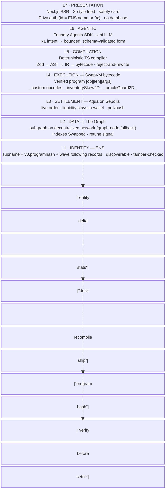
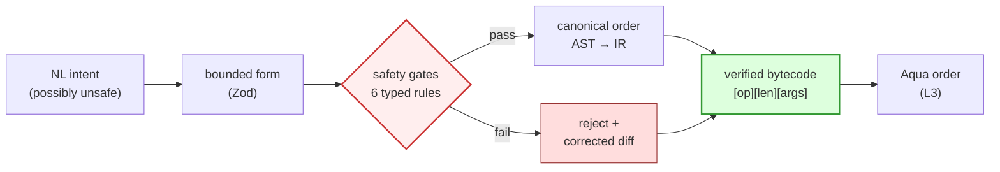

# wave

A social market for natural-language on-chain strategies, built on 1inch **SwapVM**. Built for ETHGlobal Lisboa 2026 (Classic "from scratch" track).

> 1inch built a **VM for swap orders** — where a market-making strategy is a bytecode *program*, not a deployed contract — but **no compiler**. wave ships the compiler *and a social feed around it*: tell it your strategy in a sentence; it ships a safety-checked market maker live on-chain, then posts it to a public feed where anyone can discover, follow, and trade against it.

## How It Works

wave runs a vertical pipeline (read it as 7 OSI layers). A strategist types plain intent; the LLM only parses it into a bounded form; a **deterministic compiler** turns that into verified SwapVM bytecode that settles live on **Aqua on Sepolia** (testnet). The shipped strategy gets a public description — which is also the **literal compiler input** — and appears in an **X-style feed** ranked by a real algorithm. Takers discover it via **ENS** and verify the on-chain program matches its recorded hash before settling. There is **no database**: every field on a feed card comes from the subgraph or from ENS text records.

1. **Parse intent** — strategist types *"keep ETH/USDC balanced, halt if Chainlink deviates 1.5%"*
2. **Bound it** — the z.ai LLM fills a schema-validated form (it writes no code)
3. **Compile** — deterministic TS pipeline (Zod → AST → IR → bytecode) with reject-and-rewrite
4. **Verify** — `quote()` simulates the program; safety card goes green/red
5. **Ship** — deploy the live Aqua order on Sepolia (liquidity stays in the maker wallet)
6. **Index** — a The Graph subgraph (decentralized network preferred, self-hosted graph-node fallback) emits deltas that drive the autonomous retune
7. **Settle** — taker resolves the ENS name, checks the program hash, then settles on Sepolia



| Layer | Role | Tech | Guarantee |
|---|---|---|---|
| **L7** Presentation | social UI + safety card | Next.js (App Router, SSR), Privy | discover, follow, trade-against |
| **L6** Agentic | parse intent | Foundry Agents SDK + z.ai LLM | LLM only fills a bounded form — writes no code |
| **L5** Compilation | deterministic middle | TypeScript (Zod → AST → IR → bytecode) | safe bytecode or a visible reject + corrected diff |
| **L4** Execution | run the program | SwapVM + 2 custom opcodes | `quote()` == `swap()`, by VM design |
| **L3** Settlement | live order | 1inch Aqua on Sepolia | custody never leaves the maker wallet |
| **L2** Data | retune signal | The Graph subgraph (decentralized network; graph-node fallback) | on-chain truth, pure event-indexing |
| **L1** Identity | trust root | ENS subnames + `v0.programhash` + `wave.following` | the on-chain program matches its recorded hash; follows are on-chain records |

## Sponsor Chains

| Sponsor | Role |
|---------|------|
| **1inch** | SwapVM + Aqua — the core VM and settlement layer; extended with 2 custom opcodes; settles on Sepolia |
| **The Graph** | Subgraph indexing `Swapped` — the agent's live retune signal + on-card stats. Deployed to the **decentralized network** (preferred over self-hosted graph-node); every card field that isn't on ENS comes from here |
| **ENS** | Subnames carrying a `v0.programhash` text record takers verify before settling (tamper-check, not cosmetic) + `wave.following` records (the follow graph) + the `description` record (the literal compiler input) |

> **No database (intentional):** every field on a feed card comes from **The Graph (L2)** or from **ENS (L1)** — swaps, hashes, volume and fills from the subgraph; descriptions, avatars and the follow graph from ENS text records. There is no off-chain store to unplug. The one social verb that maps to nothing on-chain, *comment*, is cut; *like* becomes the capital already on the card; *follow* becomes a `wave.following` record on the follower's own ENS name.

## Features

- **Natural-language strategies** — type a sentence, get a verified SwapVM program
- **It's a compiler, not a template picker** — composes typed blocks into any *valid* permutation, not N fixed templates
- **Reject-and-rewrite safety gate** — a malicious intent (e.g. oracle guard after the skew) is visibly refused, then corrected with a side-by-side diff
- **`quote()` == `swap()` by design** — the safety check is native to the VM, not bolted on
- **Two new VM opcodes** — `_inventorySkew2D` (inventory rebalance) + `_oracleGuard2D` (maker-protection circuit breaker)
- **A real social ranking — not a like count** — the feed is ranked by `rank = returnPct × recencyDecay × (1 + log2(1 + followers))`: the card's return % (PnL ÷ committed capital, from the subgraph), decayed by age (24h half-life), nudged by follows (count of ENS `wave.following` records). Listed (≥3 fills, ≥1h age) else shown unranked. *Stage line: "ranked by how much it's gained, decayed by age, nudged by follows."* Every term comes from chain or ENS — still no DB.
- **X-style social feed** — public descriptions (the literal compiler input), an ENS follow graph (`wave.following` records), trade-against. *Likes are capital:* the card already shows committed volume and fills, so the signal that a strategy is good is said by someone who put money behind it, not a thumb. *Comment* maps to nothing on-chain and is cut.
- **ENS tamper-check** — every card proves the on-chain program matches its recorded hash

## Why a compiler, not a template picker



1. **Deterministic assembly** — enforces a canonical, security-critical instruction order (wrong order = wrong settlement math).
2. **It rejects unsafe programs** — type a malicious intent and it visibly refuses, then emits the corrected bytecode with a diff. A template can't do that.
3. **It composes** — a few typed blocks generate any valid permutation, not N fixed templates.

## We extended the VM (L4)

Two new first-class instructions, each proven against SwapVM's seven documented invariants:

| Opcode | What it does |
|---|---|
| **`_inventorySkew2D`** | keeps maker inventory near a target ratio via a deviation-weighted penalty |
| **`_oracleGuard2D`** | maker-protection circuit breaker — reverts/clamps on oracle deviation, **always reverts on staleness** (the demo's judge-triggered halt) |

These are trust-free VM instructions, not `_extruction` external calls (which 1inch's own code warns takers must validate, since they can silently break quote/swap consistency).

## Tech Stack

- **Solidity 0.8.30** / Foundry — SwapVM (forked 1inch, release/1.1) + 2 custom opcodes + `StrategyFactory`, deployed on **Sepolia**
- **1inch Aqua** — settlement on Sepolia; `ship()`/`dock()`/`pull()`/`push()` (custody stays in the maker wallet). 1inch ships Aqua on mainnets only, so we deploy the Aqua stack ourselves on Sepolia via the swap-vm-template flow — see [PROD-TESTNET.md](./docs/strategy/PROD-TESTNET.md)
- **TypeScript** — deterministic compiler (Zod → AST → IR → bytecode) + agent (viem, `@1inch/aqua-sdk`)
- **Next.js** (App Router, SSR) + React — split-screen UI + safety card; `getFeed()` SSR from subgraph+ENS, `/api/compile` + `/api/stream` route handlers
- **The Graph** — subgraph (AssemblyScript mapping, GraphQL) deployed to the **decentralized network** (preferred); self-hosted `graph-node` fallback if the network can't index Sepolia EVM — see [PROD-TESTNET.md](./docs/strategy/PROD-TESTNET.md)
- **ENS** — Sepolia deployment; subnames + `v0.programhash` (tamper-check) + `wave.following/<strategy>` (the follow graph) + `description` (the literal compiler input) text records
- **Foundry Agents SDK** + **z.ai** — intent parsing
- **Privy** — wallet auth on Sepolia (id = ENS name or `0x…`)

## Getting Started

All Foundry/contract commands run **from `srcs/requirements/swap-vm/`**, not the repo root. Deps are npm-managed (not git submodules) — install with `npm install` (or `yarn`).

```bash
# Contracts (Solidity / Foundry)
cd srcs/requirements/swap-vm
npm install
forge build
forge test -vvv --gas-report

# Once build components land (compiler/ui/subgraph/agent) — see srcs/docker-compose.yml
cd srcs && docker compose up --build
```

## Repo Layout

| Path | What's there |
|------|--------------|
| `docs/` | all documentation (sponsors, strategy, review, swap-vm-upstream) |
| `docs/strategy/` | the build docs — one job each (playbook, pitch, tech-stack, runbook, …) |
| `docs/tasks/` | the execution layer — shared plan + per-person build sheets |
| `docs/sponsors/` | one directory per sponsor; `OVERVIEW.md` = distilled knowledge |
| `srcs/requirements/swap-vm/` | Solidity/Foundry — SwapVM fork + custom opcodes |
| `srcs/requirements/{compiler,ui,subgraph,agent}/` | build components (land during the event) |
| `srcs/docker-compose.yml` | Inception-style orchestration (one folder per component) |
| `docs/swap-vm-upstream/` | vendored 1inch upstream docs (`LicenseRef-Degensoft-SwapVM-1.1`) |
| `CLAUDE.md` | project guide for Claude Code |

## Sponsor Status Board

| Sponsor | Priority | Research depth | Why |
|---|---|---|---|
| [1inch](./docs/sponsors/1inch/OVERVIEW.md) | 🔴 P0 | **deep** — whitepapers + contract source; custom-opcode recipe in [SWAPVM-INTERNALS.md](./docs/sponsors/1inch/SWAPVM-INTERNALS.md) | Chosen core — SwapVM/Aqua |
| [The Graph](./docs/sponsors/the-graph/OVERVIEW.md) | 🔴 P0 | **good** — AI suite, x402, standardized subgraphs | Chosen data layer |
| [ENS](./docs/sponsors/ens/OVERVIEW.md) | 🔴 P0 | **good** — ENSIP-25 + 26, ens-cli | Chosen identity layer |
| Hedera | 🟡 P1 | stub (idea-B fallback) | Fallback — agent economy |
| World | 🟡 P1 | stub | Wildcard (not chosen) |
| Uniswap / 0G / Sui | ⚪ P2 | stubs | Not chosen |

> Prize picks (3 selections, the max): **1inch + The Graph + ENS**. See [IDEAS.md](./docs/strategy/IDEAS.md).

## Documentation

### Strategy docs (`docs/strategy/`) — one job each

| Doc | Job |
|-----|-----|
| [PROOF-OF-CAPITAL.md](./docs/strategy/PROOF-OF-CAPITAL.md) | **THE THESIS** — *likes are liquidity, the feed is The Graph, profiles are ENS.* Read first; everything else serves this |
| [10-10-PLAYBOOK.md](./docs/strategy/10-10-PLAYBOOK.md) | **THE BUILD PLAN** — finalist reframe, opcode/compiler spec, 5 moves, 36h Gantt, 10/10 scorecard |
| [frontend.md](./docs/strategy/frontend.md) | **THE UI SPEC** — pages, routes, panes, data flow, colors, demo beats, failure tree |
| [PITCH.md](./docs/strategy/PITCH.md) | the demo — 3-act narrative, killer facts, Q&A armor, sponsor judge lenses |
| [EVENT-RUNBOOK.md](./docs/strategy/EVENT-RUNBOOK.md) | the 36h ops — gates, cut order, demo failure tree, key matrix, submission checklist |
| [TECH-STACK.md](./docs/strategy/TECH-STACK.md) | the stack — Solidity/Foundry + TS compiler + Next.js SSR + Graph subgraph + ENS |
| [PROD-TESTNET.md](./docs/strategy/PROD-TESTNET.md) | running wave as a real product on **Sepolia** — no mock, no fork: Aqua/SwapVM self-deploy, decentralized-Graph-vs-graph-node, ENS on Sepolia, Privy, demo seeding, risks |
| [IDEAS.md](./docs/strategy/IDEAS.md) | why this idea (and the fallback, and why-not-Uniswap) |
| [COUNCIL-VERDICT.md](./docs/strategy/COUNCIL-VERDICT.md) | decision record — the 3 chair conflict-rulings + kill list |

### Build tasks (`docs/tasks/`) — the execution layer

| Doc | Job |
|-----|-----|
| [tasks.md](./docs/tasks/tasks.md) | **INDEX** — board at a glance, reading order, working agreement, Sunday staffing |
| [Plan.md](./docs/tasks/Plan.md) | **shared backbone** — checkpoints (G1/G2/G3), parallel timeline, handoff contract, risks |
| [Flaviano.md](./docs/tasks/Flaviano.md) | P1 · 1inch/Solidity (opcodes, invariant/mutation tests, fork, `graph deploy`) |
| [Flavio.md](./docs/tasks/Flavio.md) | P2 · Compiler + ENS (emit, reject-and-rewrite, hash-verify) |
| [Pietro.md](./docs/tasks/Pietro.md) | P3 · Graph + Social UI + demo + all submission prose |

---

**Event:** ETHGlobal Lisboa · build starts Fri Jul 24, 2026 · submission Sun Jul 26, 09:00 WEST (~36h)
**Team:** 3 devs, Classic "from scratch" track · **Goal:** top-10 finalist
**Prioritization principle:** *Finalist = best overall project.* Optimize for finalist, not sponsor EV — the core work (opcodes, compiler, safety proof) double-counts toward both finalist and the 1inch/ENS prizes.
