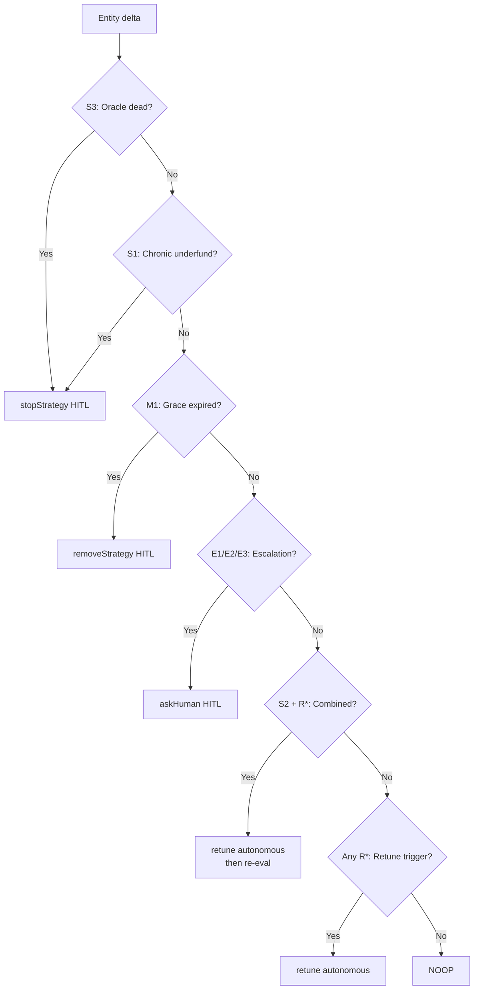

# AGENT — The Autonomous Retune Layer

_The Mastra + z.ai + custom MCP architecture, the HITL posture, and the policy that turns a Swapped event into an adapted position. The agent is the machine that proves the metric is caused by on-chain capital._

> **Posture invariant (verbatim, also in MEMORY.md):** *Retune is always autonomous, zero-click, and caused by a live subgraph entity delta. HITL gates only `{stopStrategy, removeStrategy, changeOracleBand, askHuman}`. The HITL set and the retune set are disjoint — no approval path can produce or delay a retune.*

## Architecture — the agent container

The agent runs in its own container (matches `srcs/docker-compose.yml` L95–110). The stale "in-process inside Next.js" wording in `TECH-STACK.md` / `EVENT-RUNBOOK.md` / `PROD-TESTNET.md` has been corrected alongside this doc — this is the canonical architecture:

```mermaid
block-beta
    columns 1
    subgraph container["Agent Container (srcs/requirements/agent/)"]
        direction TB
        mastra["Mastra Runtime\nagents + workflows + MCPServer + approval gate"]
        mcp["Custom MCP Server\nMCPServer + @modelcontextprotocol/sdk"]
        llm["z.ai LLM\nAI SDK OpenAI-compatible provider"]
        mastra --> mcp --> llm
    end
    subgraph outside["Outside Container"]
        graph["The Graph Subgraph (read)"]
        chain["Router + StrategyFactory + Aqua (write)\nviem — announce · attribute · approve · ship"]
        ledger["Ledger approval\ndevice signature verification"]
        ui["Next.js UI\nactions + /api/stream proxy"]
    end
    mcp --> graph
    mcp --> chain
    mcp --> ledger
    mcp -.-> ui
```

Next.js talks to the agent over internal HTTP/SSE (`AGENT_URL=http://agent:3002`), keeping LLM and wallet keys out of the UI process. The agent's `instructions.md` cites this doc as the source of truth.

## Subagent decomposition

Four subagents (the ENS agent was removed with the ENS layer at continuity — `f441287`; identity now comes from the wallet + on-chain authorship + the Ledger approval gate):

| Subagent | Owner | Capability |
|---|---|---|
| **composeAgent** | P2 | NL → Zod spec (Beat A). Bounded DSL output only; writes no code. |
| **monitorAgent** | P3 | Polls the subgraph for entity deltas; runs `policy.decide()` on each tick. |
| **retuneAgent** | P2 | Autonomous dock → recompile → ship. **Never gated**; this is the Graph-track invariant. |
| **gateAgent** | P3 | Owns the HITL queue + `/review` contract. Executes only post-approval. |

One Mastra `Workflow` wires `monitor → {retune | gate}`. When `monitorAgent` detects a threshold breach, it evaluates the pure policy (`decide()`). If the path is `retune`, it routes to `retuneAgent` directly (autonomous). If the path is stop/remove/escalation, it hits `workflow.suspend({kind:"stopStrategy"})` and parks the action at `/review` for human approval.

## The MCP tool surface

> **Status (ETHOnline, 12 Sep 2026):** implemented — `srcs/requirements/agent/src/mcp/{server,reads,writes}.ts` are live, plus the HTTP tools the UI calls (`/api/tools/<tool>/execute`). The trust layer is the **approval gate** (`src/ledger/approval.ts`): ships under `LEDGER_GATE=session|device` need a fresh EIP-191 signature over the canonical action hash — device mode pins the Ledger, session mode pins the author. The MCP surface itself is open reads; R1–R4 retunes stay zero-click.

Tools are registered in `srcs/requirements/agent/src/mcp/server.ts` via Mastra's `MCPServer`. **No business logic lives in the MCP layer** — policy lives in `src/policy/` as pure functions, testable without the LLM. Naming: tools are `mcp__wave__<tool>`.

### Tool groups

| Group | Tools | Authz |
|---|---|---|
| **Reads (RO — all agents)** | `getStrategy`, `listStrategies`, `getSwapHistory`, `getFeed`, `getProgramHash`, `quote` (read-only `asView()` sim), `getOracleState`, … | All agents |
| **Writes — ship path** | `shipStrategy` — the full first-deploy pipeline (see below); the UI's compose drawer + compose page call it via the tool-execute HTTP route with the session wallet as `author` | gated by the UI's own HITL confirm + the approval signature server-side |
| **Writes — autonomous (only retuneAgent)** | `retune` (dock→recompile→ship + evidence log), `recompileAndShip` | retuneAgent only |
| **Writes — HITL-gated** | `stopStrategy`, `removeStrategy`, `changeOracleBand` | gateAgent executes post-approval |
| **Escalation** | `askHuman` (genuine-question channel; `suspend({kind:"askHuman"})`) | Any agent → HITL queue |

### The ship pipeline (`actions/deployStrategy.ts`) — one id everywhere

```
compile (wave-compiler CLI, on-chain decimals folded in)
  → announce (router, onlyOwner; described overload → StrategyDescribed)
  → attribute (factory.attribute(strategyId, author) — best-effort; StrategyAttributed)
  → approve ×2 (max to Aqua)
  → ship (aqua.ship(router, WRAPPED abi.encode(order), tokens, amounts))
```

Load-bearing invariant: `strategyId = keccak(wrapped abi.encode(order)) = SwapVM.hash(order) = the Aqua dock hash = the subgraph Strategy.id`. Solidity's `abi.encode` of a single struct argument is the **wrapped** form (`0x20` offset word + tuple body) — ship must hand Aqua those exact bytes or the dock lands under an unreachable hash (capital never indexes, swaps can never spend it; both failure modes fork-proven). A re-ship of the same program reverts `0x879f237b` — duplicate dock, by design. Ordering matters too: announce precedes ship or the subgraph drops the events (F2).

### Authz matrix

| Tool | compose | monitor | retune | gate |
|---|---|---|---|---|
| All reads + `quote` | ✓ | ✓ | ✓ | |
| `retune` / `recompileAndShip` | | ✓(decides) | ✓(exec) | |
| `shipStrategy` (HTTP tool path) | ✓ (via UI HITL + approval signature) | | ✓ | |
| `stop`/`remove`/`changeOracleBand` | | ✓(decides) | | ✓(exec post-approval) |
| `askHuman` | ✓ | ✓ | | ✓ |

## The strategy-change/removal policy

The policy lives in `srcs/requirements/agent/src/policy/` as **pure functions, no LLM** — so the "caused by the data" claim is defensible and the policy is unit-tested (RED on mutation, à la Move #2).

### Retune triggers (autonomous — never gated)

- **R1** `ΔcumulativeVolume/committedCapital ≥ 0.20` → retune (the existing `shouldRetune()`).
- **R2** Inventory skew drift `|share−target| > maxSkewBps` sustained ≥3 fills → retune.
- **R3** Oracle fills approaching band edge (within 20% of `maxDeviationBps`) → retune.
- **R4** `returnPct` 24h < `returnPct` 7d × 0.5 AND ≥3 fills → retune.

### Stop/remove triggers (HITL-gated)

- **S1** Chronic underfunding — agent-side `quote()` simulates a revert on ≥3 consecutive checks (no subgraph change) → `stopStrategy`. Cite `docs/sponsors/1inch/OVERVIEW.md` L46.
- **S2** `returnPct < −0.15` sustained across N 1h windows → `stopStrategy`.
- **S3** Oracle `updatedAt` older than `2 × maxStalenessSecs` → `stopStrategy`.
- **S4** No `Swap` for 72h while `cumulativeVolume > 0` → `stopStrategy`.
- **M1** `wave.status=stopped` for 7d with zero activity → `removeStrategy`.

### Escalation (`askHuman`)

- **E1** Two valid retune directions conflict.
- **E2** Policy precedence can't resolve (e.g., S1+S2 fire together).
- **E3** Signal outside modeled space (forward-compat escape hatch).

### Precedence (`decide()` — first match wins)

```typescript
// 1. S3 (oracle dead)              → stop(HITL)        // unrecoverable
// 2. S1 (chronic underfund)        → stop(HITL)
// 3. M1 (grace expired)            → remove(HITL)
// 4. E1|E2|E3                      → askHuman(HITL)
// 5. S2 AND any R*                 → retune first, re-eval next tick   // give it a chance
//    S2 alone                      → stop(HITL)
// 6. any R* (R1–R4)                → retune (autonomous)              // the Graph invariant
// 7. otherwise                     → NOOP
```



**Falsifiable test invariants:** stop precedence > retune; retune-before-stop on S2+R*; escalation never blocks a retune; no HITL path produces a retune.

## Thesis link — the agent proves the metric

The agent is the machine that turns a `Swapped` event into an adapted position. See `docs/strategy/PROOF-OF-CAPITAL.md` for the full thesis. The retune evidence log (query + entity ID + delta + threshold decision + dock/ship tx hashes) is the artifact proving the social metric is *caused by on-chain capital*. Without this chain, the "likes are liquidity" claim is just words; with it, the judge can trace the exact entity delta that fired the retune.

## Graph-track scoring — zero-click, data-caused

From `docs/sponsors/the-graph/OVERVIEW.md` L40/L45: the retune must be data-caused + zero-click; the 9→10 miss is a time-triggered retune. Our `retune` tool is autonomous-group only; HITL never touches it. Every retune cites the entity ID in the evidence log — that's the proof.

## Contradictions resolved

- **Agent is its own container** — matches `srcs/docker-compose.yml` L95–110. The stale "in-process inside Next.js" wording across the strategy/task docs (`TECH-STACK.md`, `frontend.md`, `EVENT-RUNBOOK.md`, `PROD-TESTNET.md`, `Flavio.md`, `Plan.md`) has been corrected to match. The client-side invariant still holds — the UI owns no business logic on the client; only the topology changed (the agent is now a separate service, reached over `AGENT_URL`, not imported in-process).
- **Ownership split:** P2 (Flavio) owns the agent brain + action arms + ENS writes; P3 (Pietro) owns subgraph schema/mapping + UI + the `/review` queue surface; P1 (Flaviano) owns on-chain + deploy.
- **Handshake:** the subgraph endpoint (P3 authors, P1 deploys, P2 consumes).

## Build-time API discovery

Mastra is fast-moving. Exact symbols are resolved at build time via the installed `mastra-ai/skills` skill + `@mastra/mcp-docs-server` + `mastra.ai/llms.txt`. This doc fixes structure and behavior; the build fixes exact symbols.

## The retune stream (ETHOnline) — `/api/stream/retune`

The monitor's decisions surface live: a Mastra `apiRoutes` Hono route (`src/mastra/routes/retune-stream.ts`) emits one SSE `data:` frame per action (`noop` suppressed), with **per-connection dedup** keyed `${strategyId}:${trigger ?? type}:${entityId}` — `poll()` is a snapshot, not a diff, so dedup is mandatory or every tick re-toasts the same entity. `: keepalive` comments keep the connection warm; the UI's `/api/stream` proxies it (connect-only timeout — never abort the body).

## Directory layout (as built)

```
srcs/requirements/agent/
├── package.json          # mastra, @modelcontextprotocol/sdk, @ai-sdk/openai-compatible, viem, @1inch/aqua-sdk, @worldcoin/agentkit, zod, graphql-request; dev: vitest
├── src/
│   ├── mastra/
│   │   ├── index.ts                      # registry: agents + workflows + MCPServer + apiRoutes + AgentKit gate
│   │   ├── agents.ts / compose.agent.ts  # compose, monitor, retune, gate (ens agent removed with ENS)
│   │   └── routes/retune-stream.ts       # SSE feed the UI proxies
│   ├── mcp/{server,reads,writes}.ts      # tool surface; writes carry author + attribute
│   ├── workflows/                        # monitor + HITL suspend/resume
│   ├── policy/                           # pure fns — the most-tested module
│   ├── monitor/graphDelta.ts             # subgraph delta source (graph-node or stub)
│   ├── world/{gate,middleware,verify,storage}.ts  # AgentKit MCP gate + libsql usage/nonce store
│   ├── actions/
│   │   ├── deployStrategy.ts             # first-deploy: compile→announce→attribute→approve→ship (one id)
│   │   └── recompileAndShip.ts           # retune arm
│   ├── clients/{subgraph,aquaWrite,factoryWrite}.ts  # viem write clients (attribute = factoryWrite)
│   ├── config/env.ts                     # announcer validation, world config, storage
│   └── test/                             # 115 tests: pipeline, gate, stream, policy, schema
└── .mastra/output/                        # built bundle the container runs
```
