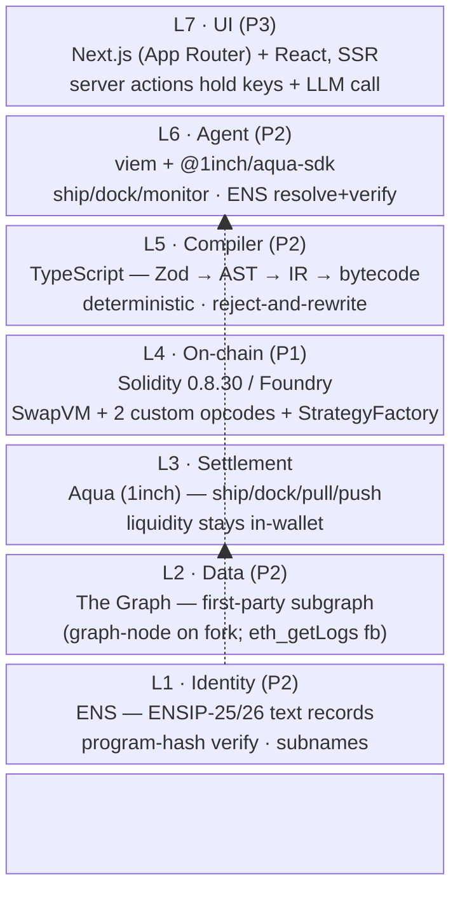

# wave — Tech Stack

_The "what we build with" reference, aligned with [10-10-PLAYBOOK.md](./10-10-PLAYBOOK.md). Source of truth for the stack._

> **Single biggest constraint:** a multi-language, multi-tool surface for 3 people in 36h — Solidity + TypeScript + AssemblyScript (subgraph) + React (Next.js) + GraphQL. The non-core element with a pre-agreed escape hatch is the **subgraph** (fallback: `eth_getLogs`).

## At a glance — the 7 layers

All demo runs target **live Sepolia** — the chain does the real work; the UI is a view layer. No anvil fork, no mock data. Full plan: [PROD-TESTNET.md](./PROD-TESTNET.md).

## By layer

### L4 — On-chain core (P1) · Solidity / Foundry
- **SwapVM** (forked 1inch, release/1.1) — the VM that runs swap orders as bytecode programs. Solidity **0.8.30**, `via_ir = true`, `optimizer_runs = 700`, custom Yul steps.
- **2 custom opcodes** we add: `_inventorySkew2D` (two-sided inventory pricing, clamped to oracle band) + `_oracleGuard2D` (maker-protection circuit breaker: revert/clamp on oracle deviation, halt on staleness).
- **`StrategyFactory.sol`** — thin on-chain wrapper over `ProgramBuilder.build`; opcode indices resolved from function pointers, never hand-counted.
- **Foundry** for everything: `forge build/test`, fuzz/property invariant tests (incl. the mutation-killing suite), gas snapshots. `make` for deploy.
- **Aqua** (1inch balance protocol) — settlement layer; `ship()`/`dock()`/`pull()`/`push()`. Custody stays in the maker wallet.
- **1inch solidity-utils over OpenZeppelin** where they overlap (`SafeERC20` exports `IERC20`+`IWETH`, `ECDSA`, `TransientLock`). OZ only for `EIP712`, `Math`, `SafeCast`.

### L5 — Compiler (P2) · TypeScript
- Pure-TS deterministic pipeline: **Zod** (validated DSL — the only place the LLM has freedom) → AST → IR → bytecode. Emits via the Solidity `ProgramBuilder`.
- The **reject-and-rewrite pass**: 6 typed safety rules (`OracleGuardMustPrecedeSkew`, `ProtocolFeeLeMakerFee`, `SaltMustBeTerminal`, `OracleStalenessRequiresGuard`, `FeeAfterCurve`, `NoDuplicateDeadline`) + canonical ordering + diff renderer.

### L6 — Agent / off-chain (P2) · TypeScript
- **Foundry Agents SDK** + **z.ai** LLM — parses NL intent into the bounded Zod form (writes no code); `graphDelta` drives the autonomous retune.
- **viem** for RPC + wallet + ENS actions (universal resolver, text records, subnames).
- **@1inch/aqua-sdk** for `ship`/`dock`/`monitor`, `calculateStrategyHash`, event decoding.
- `resolveVerify.ts` reads ENS records and verifies the on-chain program hash matches before settling.

### L7 — UI (P3) · Next.js (App Router) + React, SSR
- Three panes: intent (NL sentence) / bytecode (hex, tokenized into `[op][len][args]`) / safety card (green/red verdict from the `quote()` battery). Plus an ENS-discovery pane.
- **Why SSR / server components:** keeps the **LLM call, API keys (Studio/x402), and the compile invocation server-side** — no secrets or heavy logic shipped to the browser, and the first paint can render a cached/canned safety card before the live compile returns (the latency-fallback mechanism).
- **Server actions / route handlers** bridge to the compiler (`/compile`) + simulator (`/simulate`). The 1500ms watchdog retries the live SSE stream on timeout (disclosed); there is no canned `replay.json` to fall back to — a persistent failure is narrated honestly against the on-screen state.
- Runs against **live Sepolia** (RPC via Alchemy/Infura); the chain does the real work, the UI is a view layer. No anvil fork, no mock data.

### L2 — Data (P2) · The Graph
- **First-party subgraph** (GraphQL `schema.graphql` + AssemblyScript `mapping.ts`) indexing our own `Swapped` events — deployed to a local **graph-node** on the fork. The monitor polls for entity deltas; a threshold breach fires `dock()`+`ship()`.
- **Fallback if `graph-node` won't sync the fork:** poll `Swapped` via **`eth_getLogs`** directly (same threshold math; label "subgraph syncing"). Never cuts the retune.
- **x402** pay-per-query is the agent-native demo beat (optional, mainnet gateway, ~$5 Base USDC); **Studio API key** as one-env-var fallback.

### L1 — Identity (P2) · ENS
- **ENSIP-25** (agent registry) + **ENSIP-26** (`agent-context` / `agent-endpoint[mcp]`) text records, plus a custom `v0.programhash` record (= keccak256 of shipped bytecode).
- Universal resolver; both ENSIPs are **Draft** standards (always say "draft standard").

## Language mix

| Where | Language / tool |
|---|---|
| On-chain | **Solidity 0.8.30** |
| Compiler, agent, UI | **TypeScript** |
| Subgraph mapping | **AssemblyScript** (`graph-ts`) |
| Subgraph queries | **GraphQL** |
| UI framework | **Next.js (App Router, SSR)** + React |
| Build/test/deploy | **Foundry** (`forge`), `make`, npm/yarn |

## Dependency management (important)

Deps are **npm-managed** (`package.json` + `node_modules`), **not git submodules** — install with `npm install` (or `yarn`), not `forge install` alone. Remappings (`swap-vm/remappings.txt`) map `forge-std/`, `@openzeppelin/contracts/`, `@1inch/solidity-utils/`, `@1inch/aqua/` into `node_modules/`. All Foundry/contract commands run **from `swap-vm/`**, not the repo root.

## Riskiest non-core element

The **subgraph** (AssemblyScript + local `graph-node` syncing a fork). If it fails at 3am, the Move #5 fallback is `eth_getLogs` — same retune behavior, labeled "subgraph syncing." Everything else is either core (Solidity/TS compiler — defend at all costs) or has a trivial fallback (Studio key for x402, canned replay for the live compile).

## Demo infra

- **Live Sepolia** — real chain, real seeded strategies, real indexing (see [PROD-TESTNET.md](./PROD-TESTNET.md)). Chainlink's Sepolia feeds update live, so the happy path reads a fresh `updatedAt` directly; happy-path `maxStalenessSecs=7200`. Backup Sepolia RPC URL (Alchemy/Infura) + a second funded wallet for RPC/tx failure, on a second laptop.
- `MockAggregatorV3` (deployed on Sepolia, disclosed) drives the judge-triggered `_oracleGuard2D` halt.
